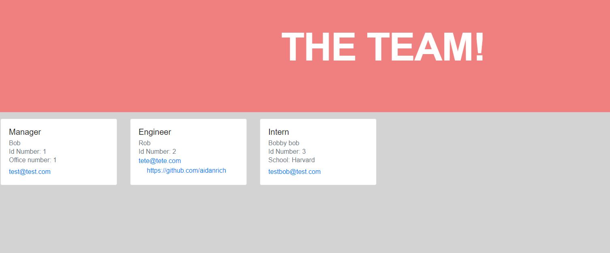

# teamprofile-gen
## Description
- We were tasked with creating a node based app that would generate HTML containing a series of cards holding employee information.
- By using this generator you can easily create a page containing employee information simply by answering a series of prompts in the terminal.
- This project helped us learn about test/jest, export.module, Node js and the inquirer package.
## Table of Contents
- [Installation](#installation)
- [Usage](#usage)
- [Credits](#credits)
- [License](#license)
## Installation
- You will need to use 'npm init' and 'npm i' in a command line while in the index.js file.
- This will give you access to both jest and inquirer, which are needed to run this app.
## Usage
- In the terminal instance use the 'node index.js' command. You will then be given prompts to answer. When finished an index.html file will be created in the 'dist' directory for your use.

- Find a video of how it works here:  https://youtu.be/I0RpnFPvVXU
- github repo: https://github.com/aidanrich/teamprofile-gen
   
## Credits
- We used the require package, https://www.npmjs.com/package/inquirer
- we also used jest, https://jestjs.io/
- Major help from my tutor Dru Sanchez.

## Badges

## License
- MIT License

Copyright (c) [2021] [Aidan Rich]

Permission is hereby granted, free of charge, to any person obtaining a copy of this software and associated documentation files (the "Software"), to deal in the Software without restriction, including without limitation the rights to use, copy, modify, merge, publish, distribute, sublicense, and/or sell copies of the Software, and to permit persons to whom the Software is furnished to do so, subject to the following conditions:

The above copyright notice and this permission notice shall be included in all copies or substantial portions of the Software.

THE SOFTWARE IS PROVIDED "AS IS", WITHOUT WARRANTY OF ANY KIND, EXPRESS OR IMPLIED, INCLUDING BUT NOT LIMITED TO THE WARRANTIES OF MERCHANTABILITY, FITNESS FOR A PARTICULAR PURPOSE AND NONINFRINGEMENT. IN NO EVENT SHALL THE AUTHORS OR COPYRIGHT HOLDERS BE LIABLE FOR ANY CLAIM, DAMAGES OR OTHER LIABILITY, WHETHER IN AN ACTION OF CONTRACT, TORT OR OTHERWISE, ARISING FROM, OUT OF OR IN CONNECTION WITH THE SOFTWARE OR THE USE OR OTHER DEALINGS IN THE SOFTWARE.